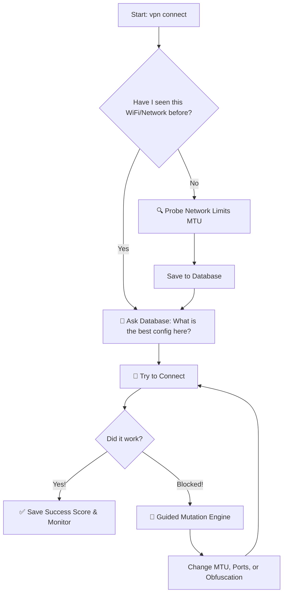

# 🛡️ VPN-Agent

**A smart, self-learning VPN manager that automatically dodges network blocks to keep you connected.**

Standard VPN clients are dumb: if a network blocks their protocol, they just fail. **VPN-Agent** is different. It acts like a digital lockpicker. If a firewall blocks your connection, the Agent analyzes the block, tweaks its settings, and tries again until it breaks through.

---

## 👁️ Visualizing the Logic

Here is exactly how the Agent thinks when you type `vpn connect`:



---

## 🧠 How It Works

* **The Brain (SQLite):** Remembers which protocols work at school vs. home. It calculates a "Reliability Score" so it always picks the fastest, most stable option first.
* **Guided Mutation:** If you’re blocked, the Agent "evolves." It tweaks packet sizes (MTU), ports, and junk headers based on what *almost* worked before.
* **MTU Prober:** Automatically finds the maximum packet size your current network allows to prevent "connected but no internet" issues.

---

## 🛠 Installation Guide

### 1. Install the "Engines" (Client-side)
The Agent is the driver, but you still need the engine. Install the core VPN binaries:

**On Arch Linux:**
```bash
# Install WireGuard and XRay (for VLESS)
sudo pacman -S wireguard-tools xray iproute2

# Install AmneziaWG (requires an AUR helper like yay)
yay -S amneziawg-tools-git amneziawg-dkms-git
```

**On Ubuntu/Debian:**
```bash
# Install WireGuard
sudo apt update && sudo apt install wireguard-tools iproute2

# Install XRay (using official script)
bash -c "$(curl -L https://github.com/XTLS/Xray-install/raw/main/install-release.sh)" @ install

# For AmneziaWG, you may need to build from source or use third-party PPAs.
```

### 2. Server Setup
Run this on your **Ubuntu 24.04** VPS to set up the multi-protocol backend:
```bash
wget https://raw.githubusercontent.com/artplay254/vpn-agent/main/setup_server.sh
chmod +x setup_server.sh
sudo ./setup_server.sh
```
*Save the `client_wg.conf`, `client_awg.conf`, and `vless.json` files provided at the end.*

### 3. Install the Agent
```bash
git clone https://github.com/artplay254/vpn-agent ~/.config/vpn-agent
cd ~/.config/vpn-agent
pip install rich  # For the terminal UI
mkdir variants logs
```

### 4. Final Permissions
Place your config files in `~/.config/vpn-agent/`. Then, give Xray permission to touch the network stack so you don't need `sudo` for every packet:
```bash
sudo setcap "cap_net_admin,cap_net_bind_service+ep" $(which xray)
```

---

## ⌨️ Command List

| Command | What it does |
| :--- | :--- |
| `vpn connect` | **The "Smart" Button.** Probes, checks the brain, and connects. |
| `vpn disconnect` | Safely kills the tunnel and restores your original internet. |
| `vpn stats` | Shows which networks you've been on and what works best there. |
| `vpn status` | Real-time traffic, protocol health, and ISP info. |
| `vpn daemon` | Background mode: auto-reconnects and mutates if you get blocked. |

---

## 🌟 Support

Built by a 15-year-old developer with a **Saiyan Mindset**—constantly breaking limits to ensure digital freedom. 

**If this tool keeps you connected, leave a ⭐ on GitHub!** 🚀🦾
