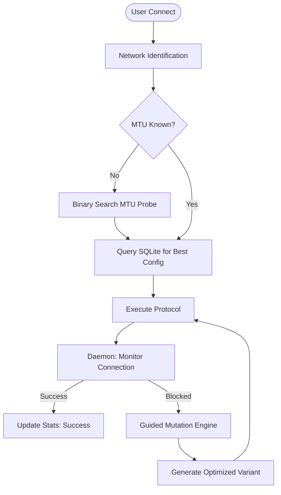

# 🛡️ VPN-Agent

**An adaptive, self-learning VPN orchestrator designed to maintain connectivity in high-censorship environments through protocol evolution.**

VPN-Agent is not a static VPN client. It is a **network-aware engine** that treats the internet as a hostile environment. By combining multi-protocol support with a **Genetic Mutation** engine and **SQLite-based analytics**, it ensures that even if one protocol is blocked by Deep Packet Inspection (DPI), the Agent will evolve its configuration to find a way through.

---

## 🚀 Core Philosophy: The Evolutionary Loop

Most VPN clients fail because they are static. **VPN-Agent** succeeds because it is iterative. It follows a four-stage biological model to maintain your connection:

### 1. Environmental Reconnaissance
Before a tunnel is even attempted, the Agent identifies its surroundings.
* **Network Fingerprinting**: It detects the current ISP and SSID to pull location-specific historical data.
* **Binary Search MTU Probing**: The Agent performs a series of high-speed ICMP/UDP probes to find the exact Maximum Transmission Unit (MTU) the network can handle without packet fragmentation, preventing "handshake stalls" common on mobile or restricted networks.


### 2. Intelligent Selection (The Brain)
The Agent doesn't guess; it calculates. Every successful connection or failed handshake is logged in a persistent **SQLite database**.
* **Weighted Scoring**: It ranks configurations based on a formula:
    $$Score = (SuccessRate \times 0.7) - (AverageLatency \times 0.3)$$
* **Contextual Priority**: If VLESS worked at the library yesterday but WireGuard failed, VLESS will be the primary choice today—automatically.

### 3. Execution & Monitoring
The Agent initiates the tunnel using the highest-rated "Variant." A background **Daemon** monitors real-world connectivity (via TCP handshakes to 1.1.1.1) rather than just checking if a process is running.

### 4. Guided Mutation (The Evolution)
If the firewall blocks all known configurations, the **ConfigMutator** triggers.
* **Parameter Shifting**: It intelligently adjusts MTU, ports, and obfuscation headers (Junk packets).
* **Success Trajectory**: If a mutation shows signs of success (e.g., a partial handshake), the Agent focuses future mutations on those specific parameters, effectively "learning" how to bypass the specific firewall of that network.

---

## 🛠 Multi-Protocol Arsenal

VPN-Agent manages three distinct layers of defense, allowing it to switch from high-performance to high-stealth instantly:

| Protocol | Strategy | Best Used For |
| :--- | :--- | :--- |
| **WireGuard** | Raw UDP performance | Gaming, streaming, and open networks. |
| **AmneziaWG** | Handshake Obfuscation | Bypassing ISPs that use basic protocol fingerprinting. |
| **VLESS + Reality** | TLS Masking | Bypassing strict state firewalls by mimicking legitimate HTTPS traffic. |

---

## 🏗 System Architecture




---

## 💻 Installation

### 1. Server-Side (The "Tower")
Run the automated installer on a clean **Ubuntu 24.04** VPS. It will install WireGuard, AmneziaWG, and Xray, then output your client configurations.
```bash
wget https://raw.githubusercontent.com/artplay254/vpn-agent/main/setup_server.sh
chmod +x setup_server.sh
sudo ./setup_server.sh
```

### 2. Client-Side (The "Agent")
Clone the repo into your config directory on **Arch Linux** or any Linux distro:
```bash
git clone https://github.com/artplay254/vpn-agent ~/.config/vpn-agent
cd ~/.config/vpn-agent
pip install rich  # For the advanced TUI dashboard
mkdir variants
```

### 3. Configuration
Place your `client_wg.conf`, `client_awg.conf`, and `vless.json` (from the server setup) into the root folder.
**Important:** Grant Xray net-admin capabilities:
```bash
sudo setcap "cap_net_admin,cap_net_bind_service+ep" $(which xray)
```

---

## ⌨️ Command Reference

| Command | Usage |
| :--- | :--- |
| `vpn connect` | The "Smart" connection mode. Probes network, selects best config, and starts tunnel. |
| `vpn disconnect` | Tears down all tunnels and restores original network routing. |
| `vpn status` | Shows active protocol, current ISP, traffic stats, and tunnel health. |
| `vpn stats` | Displays a beautiful table of all known networks and their "Best" protocols. |
| `vpn daemon` | Enters background mode to auto-recover connections and mutate configs if blocked. |

---

## 🌟 Support the Journey

This project is built by a 15-year-old developer with a **Saiyan Mindset**—committed to building tools that ensure digital freedom through constant self-improvement and technical mastery.

**If this tool keeps you connected, consider leaving a ⭐ on GitHub!** 🚀🦾
