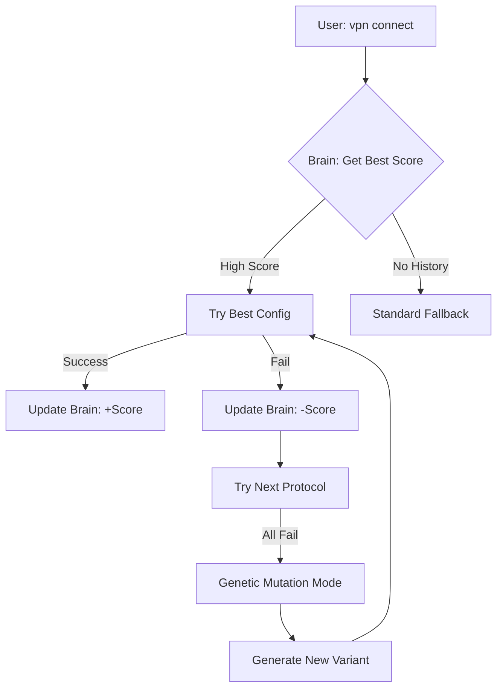

# 🛡️ VPN-Agent v0.4.0

**A self-learning, multi-protocol VPN manager designed to stay invisible and resilient against DPI.**

VPN-Agent is an adaptive CLI tool for Linux that doesn't just manage tunnels — it learns from its failures. Using a scoring engine and mutation logic, it automatically navigates through blocks to ensure you never lose internet access.

---

## 🧠 How It Works: The "Learning" Loop

Unlike standard VPN managers, VPN-Agent operates on a **Feedback Loop**. It treats every connection as a data point.

### 🔄 The Architecture Flow:

1. **Network Identification**: Upon start, the Agent detects your current **ISP/SSID** (Network Fingerprinting).
2. **Scoring Engine (Brain)**: It queries the `Brain` module to find the highest-rated protocol/config for _this specific network_ based on historical success and latency.
3. **Execution**:
   - **Success**: Great! The Agent logs the latency and maintains the tunnel.
   - **Fail**: The Agent marks the config as "failed" and immediately tries the next protocol in the hierarchy.
4. **Mutation (Evolution)**: If all standard configs fail, the `ConfigMutator` generates a new "Variant" (mutating MTU, Ports, or Obfuscation headers) to find a way through the firewall.

### 🗺️ System Flowchart



---

## ✨ Features

- **ISP-Aware Logic**: Remembers that _VLESS Reality_ works best at School, while _AmneziaWG_ is faster at Home.
- **Genetic Optimization**: Automatically tunes sensitive parameters like **MTU**, **Junk Packets (Jc/Jmin/Jmax)**, and **Ports**.
- **Multi-Layer Defense**:
  - **Layer 1: WireGuard**: Standard high-speed performance.
  - **Layer 2: AmneziaWG**: Handshake obfuscation to beat standard DPI.
  - **Layer 3: VLESS + Reality**: Stealth TLS masking to bypass strict state firewalls.
- **Self-Healing Daemon**: Background monitor that recovers connections and optimizes routing in real-time.

- **Safe daemon locking**: Prevents multiple `vpn daemon` instances from running at once with a PID lock file.
- **Config + dependency validation**: Validates `client_wg.conf`, `client_awg.conf`, `vless.json`, and required binaries before attempting a connection.
- **Self-Healing Infrastructure**:
  - **Adaptive MTU Management**: Automatically forces optimized MTU settings (e.g., 1400) during the connection phase to prevent packet fragmentation on mobile carriers.
  - **Dynamic Interface Detection**: Real-time detection of TUN devices (like `xray0`) to handle non-standard naming conventions.
  - **Kernel-Level IPv4 Force**: Ensures TUN interfaces are properly initialized with an IP and set to `UP` state on Arch Linux.
- **Advanced Monitoring**:
  - **TCP Handshake Validation**: Verifies real-world connectivity via `1.1.1.1:443` instead of unreliable ICMP pings.
  - **Persistent SQLite Database**: All connection metrics are stored in a local SQLite database (`agent_brain.db`) for reliable long-term performance tracking and intelligent config selection.
  - **Reliability Scoring**: Uses weighted success rate (70%) and latency factor (30%) to automatically select the best configuration for each network context.
  - # **Dual Logging**: Separate streams for `agent.log` (management) and `xray.log` (core).

---

## 🚀 Detailed Installation & Setup

### 1. Server-Side Deployment (Ubuntu 24.04 recommended)

Deploy your own multi-protocol stack with a single command:

```bash
wget [https://raw.githubusercontent.com/artplay254/vpn-agent/main/setup_server.sh](https://raw.githubusercontent.com/artplay254/vpn-agent/main/setup_server.sh)
chmod +x setup_server.sh
sudo ./setup_server.sh
```

\*The script will output your WireGuard, AmneziaWG, and VLESS configurations. **Save them.\***

### 2. Client-Side Installation (Arch/Linux)

```bash
# Clone the project
git clone [https://github.com/artplay254/vpn-agent](https://github.com/artplay254/vpn-agent) ~/.config/vpn-agent
cd ~/.config/vpn-agent

# Create necessary directories
mkdir variants
```

### 3. Configuration Setup

Place your server configs in `~/.config/vpn-agent/`:

- **WireGuard**: `client_wg.conf`
- **AmneziaWG**: `client_awg.conf`
- **VLESS**: `vless.json` (Use `vless.json.example` as a template)

**Important (Arch Users):** Give Xray permission to manage network interfaces:

```bash
sudo setcap "cap_net_admin,cap_net_bind_service+ep" $(which xray)
```

---

## 🛠 Usage & Commands

- **Connect (preferred)**: `vpn connect`
- **Disconnect (preferred)**: `vpn disconnect`
- **Status**: `vpn status`
- **Stats**: `vpn stats`
- # **Daemon**: `vpn daemon`
  Add an alias to your `~/.zshrc` or `~/.bashrc`:
  `alias vpn='sudo python3 ~/.config/vpn-agent/vpn_cli.py'`

| Command          | Description                                                      |
| :--------------- | :--------------------------------------------------------------- |
| `vpn connect`    | Intelligent connection based on Brain scores.                    |
| `vpn disconnect` | Cleanly shuts down tunnels and restores routing.                 |
| `vpn status`     | Real-time report: Active protocol, ISP, and Traffic flow status. |
| `vpn daemon`     | Starts background monitoring & auto-recovery.                    |

**Advanced:** Force a specific protocol:
`vpn connect --protocol vless`

---

## 🔜 Roadmap

- [ ] **Auto-Cleanup**: A "Natural Selection" worker to prune low-scoring variants.
- [ ] **Web Dashboard**: A local FastAPI UI to visualize connection success over time.
- [ ] **Geo-Awareness**: Optimized protocol selection based on GPS/GeoIP.

## 🌟 Support

Built by a 15-year-old dev with a mission to learn and build tools that matter. If this tool helped you stay connected, please **leave a star**! 🚀🦾
