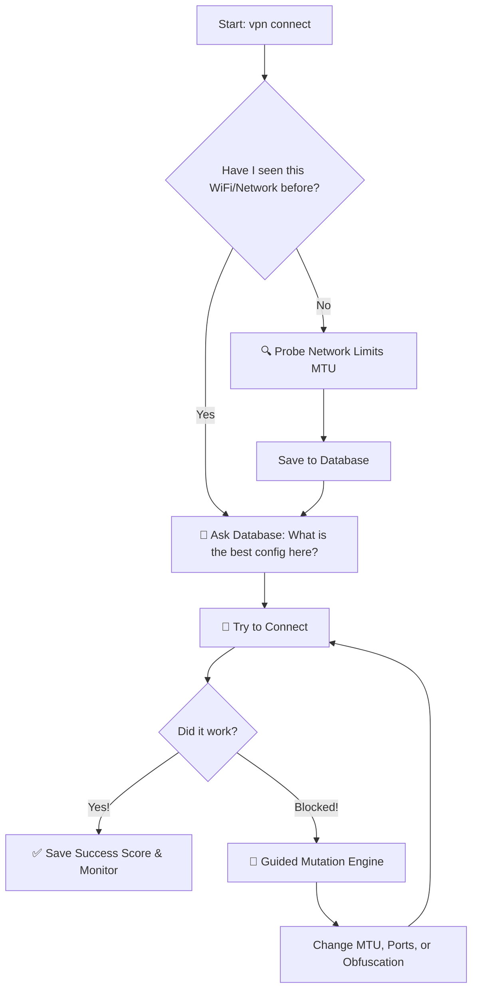

# 🛡️ VPN-Agent

**A smart, self-learning VPN manager that automatically dodges network blocks to keep you connected.**

Standard VPN clients are dumb: if a network blocks their protocol, they just fail. **VPN-Agent** is different. It acts like a digital lockpicker. If a firewall blocks your connection, the Agent analyzes the block, tweaks its settings, and tries again until it breaks through.

It remembers what works and what doesn't, so every time you connect, it gets faster and smarter.

---

## 👁️ Visualizing the Logic

Here is exactly how the Agent thinks when you type `vpn connect`:



---

## 🧠 How It Works (The Core Features)

### 1. The Brain (SQLite Database)
Instead of guessing, the Agent remembers. It saves every connection attempt into a local database (`agent_brain.db`). 
* If **VLESS** works best at your school, but **WireGuard** is faster at home, the Agent will automatically switch to the right protocol depending on where you are.
* It calculates a "Reliability Score" for every config based on success rate and ping.

### 2. Guided Mutation (The Evolution)
When the firewall blocks your connection, the Agent triggers a "Mutation." 
* It doesn't just pick random numbers. If dropping the packet size (MTU) made the connection *almost* work last time, it will keep dropping it until it finds the sweet spot. 
* It changes ports, MTU sizes, and "Junk" packet headers to disguise your traffic.

### 3. Smart Network Scanner (MTU Probing)
Before connecting to a new network, the Agent sends a few lightning-fast test packets. It automatically figures out the maximum packet size (MTU) the network allows. This prevents those annoying moments where the VPN says "Connected" but no websites load.

---

## 🛠 The Arsenal (Protocols)

VPN-Agent uses three layers of defense. If one gets blocked, it falls back to the next:

| Protocol | What it does | When to use it |
| :--- | :--- | :--- |
| **WireGuard** | Pure speed. | Home WiFi, gaming, streaming. |
| **AmneziaWG** | Disguises the handshake with "Junk" packets. | Public WiFi or ISPs that block standard WireGuard. |
| **VLESS + Reality** | Masks your traffic to look like regular HTTPS web browsing. | Strict firewalls, school networks, heavy censorship. |

---

## 💻 Installation

### 1. Server Setup (The Easy Way)
Grab a clean **Ubuntu 24.04** VPS and run this script. It will automatically install all three protocols and spit out your config files.
```bash
wget https://raw.githubusercontent.com/artplay254/vpn-agent/main/setup_server.sh
chmod +x setup_server.sh
sudo ./setup_server.sh
```

### 2. Client Setup (Linux/Arch)
Clone the tool to your machine:
```bash
git clone https://github.com/artplay254/vpn-agent ~/.config/vpn-agent
cd ~/.config/vpn-agent
pip install rich  # Required for the beautiful terminal UI
mkdir variants logs
```

### 3. Add Your Configs
Take the files the server gave you (`client_wg.conf`, `client_awg.conf`, `vless.json`) and drop them into the `~/.config/vpn-agent/` folder.

**Crucial Step for Linux Users:** Give the VPN engine permission to manage your network so you don't have to type `sudo` for every little thing:
```bash
sudo setcap "cap_net_admin,cap_net_bind_service+ep" $(which xray)
```

---

## ⌨️ Command List

| Command | What it does |
| :--- | :--- |
| `vpn connect` | The main button. Probes the network, checks the database, and connects. |
| `vpn disconnect` | Safely turns off the VPN and returns your internet to normal. |
| `vpn stats` | Shows a clean table of all your networks and which configs work best. |
| `vpn status` | Live look at your traffic, active protocol, and connection health. |
| `vpn daemon` | Runs in the background, automatically reconnecting and mutating if you drop. |

---

## 🌟 Support

Built from the ground up by a 15-year-old developer with a **Saiyan Mindset**—constantly breaking limits to ensure digital freedom. 

If this tool helped you bypass a block and stay connected, please **leave a ⭐ on GitHub!** 🚀🦾
