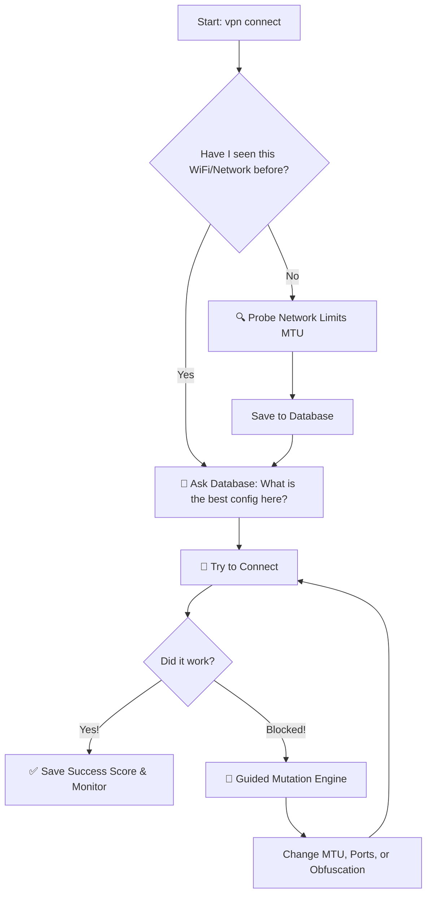

# 🛡️ VPN-Agent

**A smart, self-learning VPN manager that automatically dodges network blocks to keep you connected.**

Standard VPN clients are dumb: if a network blocks their protocol, they just fail. **VPN-Agent** is different. It acts like a digital lockpicker. If a firewall blocks your connection, the Agent analyzes the block, tweaks its settings, and tries again until it breaks through.

---

## 👁️ Visualizing the Logic

Here is exactly how the Agent thinks when you type `vpn connect`:



---

## 🧠 Deep Dive: Under the Hood

VPN-Agent isn't just a wrapper; it’s a decision-making engine. It operates using three core subsystems that communicate via a local **SQLite** state machine.

### 1. The Decision Engine (The Brain)
The Agent treats every network (identified by SSID or Gateway IP) as a unique environment. It stores metrics in `agent_brain.db` using **WAL (Write-Ahead Logging)** for high-concurrency performance.

**The Reliability Formula:**
To choose the best configuration, the Agent calculates a weighted score for every available variant:
$$Score = (SuccessRate \times 0.7) + (LatencyFactor \times 0.3)$$
* **Success Rate**: The ratio of successful handshakes to total attempts.
* **Latency Factor**: A normalized value where lower pings result in a higher score.
* **Decay**: (Optional/Planned) Recent failures weigh more heavily than successes from a month ago.


### 2. The Reconnaissance Module (Binary MTU Prober)
Standard VPNs often fail because of **MTU (Maximum Transmission Unit)** mismatch, leading to packet fragmentation that DPI firewalls easily drop. 

The Agent solves this by implementing a **Binary Search Prober**:
1.  **The Range**: It targets a window between **1200** and **1500** bytes.
2.  **The Probe**: It sends ICMP/UDP packets with the `DF` (Don't Fragment) bit enabled.
    * Command: `ping -M do -s <payload_size>`
    * Note: `Payload = MTU - 28` (20 bytes for IP header + 8 bytes for ICMP header).
3.  **The Logic**: It halves the search space with every packet. If a packet of 1400 fails, it tries 1300. If 1300 passes, it tries 1350. 
4.  **The Goal**: Finding the absolute maximum packet size in $\approx 8$ attempts.

### 3. Guided Mutation (The Evolutionary Loop)
When standard configs are blocked, the `ConfigMutator` generates "Variants." This isn't random; it's a **Directed Gradient Search**:

* **Parameter Tracking**: If a mutation that decreased MTU from 1400 to 1380 resulted in a successful (even if slow) connection, the Agent flags the "downward MTU trend" as a successful gene.
* **Exploration vs. Exploitation**: 
    * **80% of the time**, it mutates parameters in the direction of known success (Exploitation).
    * **20% of the time**, it picks a wild-card random mutation to discover new bypass vectors (Exploration).
* **Mutation Vectors**: It modifies `Jc` (Junk count), `Jmin/Jmax` (Junk size) for AmneziaWG, and TLS SNI/ShortId for VLESS Reality.


### 4. Persistence & Process Lifecycle
The Agent ensures system stability through low-level process management:
* **Atomic State**: `variant_index.json` and config updates are written to temporary files first, then moved to the final destination to prevent corruption during power loss.
* **Hardened Shutdown**: The Agent uses a **SIGTERM $\rightarrow$ Wait (5s) $\rightarrow$ SIGKILL** sequence for the Xray and WireGuard binaries to ensure no "zombie" interfaces are left hanging.
* **Real-World Validation**: Unlike other managers that just check if the process is "Running," the Agent performs a real **TLS Handshake** to `1.1.1.1:443` every 60 seconds. If the handshake fails, the tunnel is considered dead, even if the interface is "Up."

---

## 🛠 Installation Guide

### 1. Install the "Engines" (Client-side)
The Agent is the driver, but you still need the engine. Install the core VPN binaries:

**On Arch Linux:**
```bash
# Install WireGuard and XRay (for VLESS)
sudo pacman -S wireguard-tools xray iproute2

# Install AmneziaWG (requires an AUR helper like yay)
yay -S amneziawg-tools-git amneziawg-dkms-git
```

**On Ubuntu/Debian:**
```bash
# Install WireGuard
sudo apt update && sudo apt install wireguard-tools iproute2

# Install XRay (using official script)
bash -c "$(curl -L https://github.com/XTLS/Xray-install/raw/main/install-release.sh)" @ install

# For AmneziaWG, you may need to build from source or use third-party PPAs.
```

### 2. Server Setup
Run this on your **Ubuntu 24.04** VPS to set up the multi-protocol backend:
```bash
wget https://raw.githubusercontent.com/artplay254/vpn-agent/main/setup_server.sh
chmod +x setup_server.sh
sudo ./setup_server.sh
```
*Save the `client_wg.conf`, `client_awg.conf`, and `vless.json` files provided at the end.*

### 3. Install the Agent
```bash
git clone https://github.com/artplay254/vpn-agent ~/.config/vpn-agent
cd ~/.config/vpn-agent
pip install rich  # For the terminal UI
mkdir variants logs
```

### 4. Final Permissions
Place your config files in `~/.config/vpn-agent/`. Then, give Xray permission to touch the network stack so you don't need `sudo` for every packet:
```bash
sudo setcap "cap_net_admin,cap_net_bind_service+ep" $(which xray)
```

---

## ⌨️ Command List

| Command | What it does |
| :--- | :--- |
| `vpn connect` | **The "Smart" Button.** Probes, checks the brain, and connects. |
| `vpn disconnect` | Safely kills the tunnel and restores your original internet. |
| `vpn stats` | Shows which networks you've been on and what works best there. |
| `vpn status` | Real-time traffic, protocol health, and ISP info. |
| `vpn daemon` | Background mode: auto-reconnects and mutates if you get blocked. |

---

## 🌟 Support

Built by a 15-year-old developer with a **Saiyan Mindset**—constantly breaking limits to ensure digital freedom. 

**If this tool keeps you connected, leave a ⭐ on GitHub!** 🚀🦾
